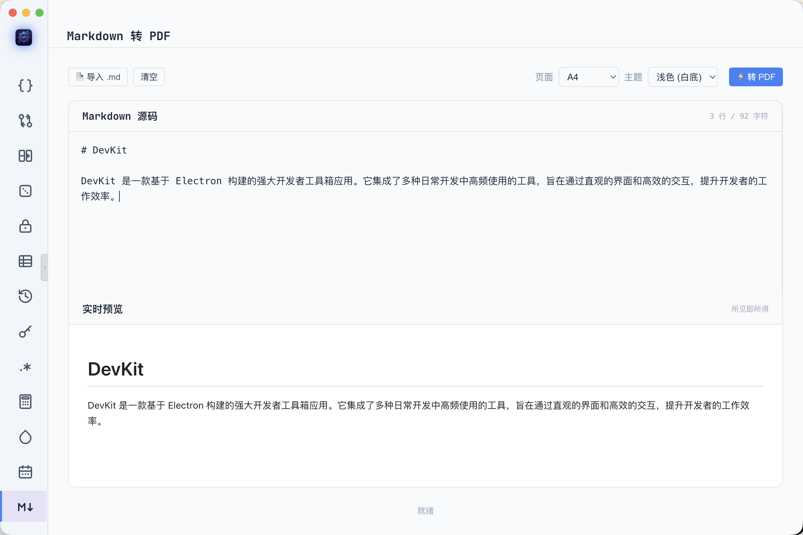

# DevKit

DevKit 是一款基于 Electron 构建的强大开发者工具箱应用。它集成了多种日常开发中高频使用的工具，旨在通过直观的界面和高效的交互，提升开发者的工作效率。

## 📸 界面预览

<table>
  <tr>
    <td align="center"><br/><b>JSON 格式化 / 校验</b></td>
    <td align="center"><br/><b>JSON 差异对比</b></td>
  </tr>
  <tr>
    <td align="center"><br/><b>Markdown 转 PDF（实时预览）</b></td>
    <td align="center"><br/><b>前端小工具集 · 颜色转换</b></td>
  </tr>
</table>

## ✨ 核心特性

### 📝 JSON 工具 (JSON Tool)
- JSON 格式化与压缩
- JSON 语法验证（错误自动跳转到出错位置）
- JSON 搜索与替换
- JSON 树形视图展示（支持虚拟滚动大数据）
- **JSON5 容错**：支持单引号、尾逗号等非标准 JSON
- **文件导入**：一键打开 `.json` 文件载入编辑器
- **精确字节数**：状态栏显示行数 / 字符数 / UTF-8 字节数

### 🔀 JSON / 文本对比工具 (Diff Tool)
- JSON 差异对比：统计新增 / 删除 / 变更数量，按类型筛选，支持路径关键词过滤
- 文本差异对比：仅显示差异行 + 可调上下文（0 / 1 / 3 / 5 行），差异块之间用省略符分隔
- 内容过多时不再淹没在冗余文本中，差异一眼可见

### 🔑 JWT 解析工具 (JWT Tool)
- 粘贴 token 自动拆解 Header / Payload / Signature
- base64url 自动解码 + UTF-8 还原
- 解析 `iat` / `exp` / `nbf` 时间字段为本地可读时间
- 过期判断：已过期红色警告，有效绿色标识
- 防抖 300ms 自动解析，XSS 防护齐全

### 🔍 正则表达式测试工具 (Regex Tool)
- 实时高亮所有匹配项
- 5 个修饰词开关：`g` / `i` / `m` / `u` / `y`
- 捕获组明细表格展示
- 匹配数统计，语法错误红色提示
- 防抖 200ms 实时执行

### 🔢 数字工具集 (Numeric Tool)
- **UUID 生成**：v4（`crypto.randomUUID`）/ v7（时间戳高位算法），批量 1–1000 个，大小写 / 连字符可切换
- **进制转换**：2 / 8 / 10 / 16 互转，字符合法性校验，位长说明，53-bit 安全整数保护

### 🎨 前端小工具集 (Frontend Tool)
- **颜色格式转换**：HEX / RGB / HSL / HSV / CMYK 五格式实时互转，**点击大色块弹原生 color picker 选色**，最近 10 个历史色可恢复
- **HTML 转义 / 反转义**：`<div>` ↔ `&lt;div&gt;`，五字符全转义

### 📊 表格工具 (Table Tools)
强大的表格数据转换与处理工具：
- **文本源格式**：CSV、JSON、YAML、XML、HTML、Markdown（粘到 textarea 自动解析）
- **二进制源**：Excel (xlsx) 通过「上传文件」按钮加载
- **导出格式**：CSV、Excel、JSON、YAML、XML、HTML、Markdown、SQL、ASCII、LaTeX
- 操作历史（撤销 / 重做）
- 数据去重、转置、清除空行、大小写转换、首字母大写、查找替换
- 单元格直接编辑，失焦保留光标，XSS 防护

### 📄 Markdown 转 PDF (Markdown PDF)
- **实时预览**：左右分栏，左侧输入 Markdown 源码，右侧实时渲染预览（所见即所得）
- **GFM 支持**：表格、删除线、任务列表、自动链接等 GitHub Flavored Markdown 全特性
- **页面选项**：A4 / A5 / Letter / Legal 四种纸张规格
- **主题切换**：浅色（白底）/ 羊皮纸 / 深色三种 PDF 配色主题
- **文件导入**：一键打开 `.md` / `.markdown` / `.txt` 文件载入
- **中文友好**：基于 Electron 原生 `printToPDF`，完美渲染中文与 CJK 字体，无需额外字体文件
- **所见即所得**：预览与最终 PDF 使用同一套样式表，输出结果与预览完全一致

### 🧰 PDF 工具箱 (PDF Toolbox)
一站式 PDF 处理工具，Tab 分组聚合 12 项能力，纯 JS 离线优先：
- **格式转换**
  - PDF → Word：提取文本生成 .docx（标题启发式）
  - PDF → Excel：按坐标聚类文本/表格生成 .xlsx
  - PDF → PPT：逐页渲染 PNG 全屏铺入幻灯片
  - PDF → 图片：逐页渲染 PNG / JPG，可选 96/150/200 DPI，输出到目录
  - Office → PDF：自动检测 LibreOffice 高质量转换；未安装时 Word/Excel 走纯 JS 降级（HTML → 原生 printToPDF），PPT 提示安装 LibreOffice
- **页面操作**
  - 拆分：每页一个 PDF / 按范围分组，统一 `1-3,5,8-10` 范围语法
  - 合并：多文件选区拼接
  - 提取页面：按范围抽出为新 PDF
  - 删除页面：按范围剔除后输出
- **安全优化**
  - 压缩：可调 DPI + JPEG 质量 + 灰度，逐页重排（有损，类在线压缩器）
  - 加密：用户密码 + 所有者密码 + 权限开关（打印/复制/修改/批注）
  - 解密：优先 pdf-lib 密码重存，失败降级隐藏窗口 + Chromium 原生密码框 + printToPDF
- **拖拽支持**：拖入文件即载入，自动按 tab 过滤扩展名

### ⏰ 时间戳工具 (Timestamp Tool)
- 秒级 / 毫秒级时间戳双向转换
- 本地时间与 ISO 格式
- 一键复制

### 🔐 加密工具 (Crypto Tool)
- 多算法：AES / DES / RC4 / TripleDES / Rabbit
- 摘要：MD5 / SHA256
- 编码：Base64 / URL
- 可配置密钥

### 🔑 密码生成器 (Password Tool)
- 自定义长度
- 字符类型选项（大写、小写、数字、特殊字符）
- 密码强度实时显示

### ⚙️ 设置中心 (Settings)
- 皮肤切换：深邃蓝（默认深色）、纯白（浅色）、豆沙绿（护眼）、暖羊皮（护眼）
- 字体偏好

## 📥 下载与安装

普通用户无需配置环境，直接下载安装包即可：

👉 **前往 [Releases](https://github.com/phpxcn/devkit/releases) 页面下载最新版本**

根据操作系统选择对应文件：

| 平台 | 下载文件 | 安装方式 |
| --- | --- | --- |
| **macOS**（Apple 芯片 M1/M2/M3） | `DevKit-x.x.x-mac-arm64.dmg` | 打开 dmg，把图标拖入 `Applications` |
| **macOS**（Intel 芯片） | `DevKit-x.x.x-mac-x64.dmg` | 同上 |
| **Windows**（Win 10/11） | `DevKit-x.x.x-win-x64.exe` | 双击运行安装向导，可选安装路径 |
| **Linux**（Debian / Ubuntu） | `DevKit-x.x.x-linux-x64.deb` | `sudo dpkg -i DevKit-*.deb` |
| **Linux**（通用） | `DevKit-x.x.x-linux-x64.AppImage` | `chmod +x` 后直接运行，免安装 |

> 不确定 Mac 芯片型号？点左上角 Apple 菜单  → 「关于本机」查看「芯片」一栏：Apple M 系列选 `arm64`，Intel 选 `x64`。

### ⚠️ 首次打开提示（重要）

本项目为个人开源软件，**未做付费代码签名**，首次安装时系统可能拦截，属正常现象：

- **macOS** 提示「无法打开，因为它来自身份不明的开发者」
  → 不要点「移除」，改为**右键（或 Control + 单击）应用图标 → 打开 → 再点「打开」**即可。
  若右键仍被拦，终端执行：`xattr -cr /Applications/工坊\(DevKit\).app`

- **Windows** 弹出蓝色「Windows 已保护你的电脑 / 未知发布者」
  → 点「**更多信息**」→ 再点「**仍要运行**」即可安装。

### 🔄 自动更新
应用内置自动更新：发布新版本后，打开应用会自动检测并提示升级（Windows / Linux 支持静默更新；macOS 因未签名需手动下载安装）。

## 🛠 技术栈

- **框架核心**: [Electron](https://www.electronjs.org/) (v28)
- **核心依赖**:
  - `xlsx` - Excel 文件解析与导出
  - `papaparse` - CSV 文件解析
  - `js-yaml` / `json5` - YAML / JSON5 格式转换
  - `marked` - Markdown 解析 (Markdown 转 PDF 工具)
  - `pdf-lib` / `pdfjs-dist` - PDF 结构操作与渲染 (PDF 工具箱)
  - `docx` / `pptxgenjs` / `mammoth` - Office 文档生成与解析 (PDF 工具箱)
  - `jspdf` / `jspdf-autotable` - PDF 导出支持
  - `crypto-js` - 加密解密
  - `codemirror` - 代码编辑器
  - `lz-string` - 字符串压缩
  - `electron-updater` - 自动更新

## 🚀 启动与开发

确保本地已安装 [Node.js](https://nodejs.org/)（推荐 v18+）。

```bash
# 1. 安装项目依赖
npm install

# 2. 启动本地开发环境
npm start
```

> **国内网络提示**：`npm install` 时 electron 二进制下载可能超时。可在项目根目录添加 `.npmrc`：
> ```
> electron_mirror=https://npmmirror.com/mirrors/electron/
> electron_builder_binaries_mirror=https://npmmirror.com/mirrors/electron-builder-binaries/
> ```

## 📦 打包构建

本项目使用 `electron-builder` 进行各平台的打包构建：

```bash
# 构建 macOS 应用程序 (.app / .dmg)
npm run build-mac

# 构建 Windows 应用程序 (.exe)
npm run build-win

# 构建 Linux 应用程序 (.AppImage / .deb / .snap)
npm run build-linux
```

<!-- 发布新版本只需两步，GitHub Actions 会自动完成三平台打包并发布到 Releases：

```bash
npm version patch          # 1.2.0 → 1.2.1，自动生成 commit 与 tag
git push origin main --tags # 推送 tag 触发 CI
```

CI 配置见 [`.github/workflows/release.yml`](.github/workflows/release.yml)：推送到 `v*` tag 时，`macos-latest`（arm64 + x64）、`windows-latest`、`ubuntu-latest` 三个任务并行构建，产物由 `electron-builder` 直接上传并发布到 GitHub Releases，用户在 Releases 页面即可下载。 -->

> 国内网络下 `npm install` 可能拉取 Electron 超时，本地构建前可参考上方「启动与开发」配置 `.npmrc` 镜像。

## 📁 项目结构

```
DevKit/
├── main.js              # Electron 主进程（窗口管理 / IPC / 自动更新）
├── preload.js           # 预加载脚本（contextBridge: 剪贴板 / 对话框 / 外链）
├── index.html           # 主页面（侧边栏导航）
├── package.json         # 项目配置
├── .github/workflows/   # GitHub Actions 发布流水线（打 tag 自动打包并发 Release）
│   └── release.yml
├── assets/              # 静态资源
│   └── icons/           # 应用图标
├── src/
│   ├── renderer.js      # 渲染进程入口（ToolRegistry / 动态加载引擎）
│   ├── styles.css       # 全局样式（CSS 变量 / 主题）
│   ├── models/          # 数据模型
│   │   └── TableDataset.js
│   ├── converters/      # 格式转换器
│   │   ├── TableConverterManager.js
│   │   ├── TableConverters.js          # CSV / Excel
│   │   ├── MarkdownConverter.js
│   │   └── MoreConverters.js           # JSON / YAML / XML / HTML / SQL / ASCII / LaTeX
│   ├── ui/              # UI 组件
│   │   └── JSONTreeView.js
│   └── tools/           # 工具模块（每个工具: view.html + module.js + 可选 style.css）
│       ├── JsonTool/                   # JSON 格式化（含 core.js 核心逻辑）
│       ├── JsonDiffTool/               # JSON 对比
│       ├── TextDiffTool/               # 文本对比
│       ├── JwtTool/                    # JWT 解析
│       ├── RegexTool/                  # 正则表达式测试
│       ├── NumericTool/                # UUID 生成 + 进制转换
│       ├── FrontendTool/               # 颜色转换 + HTML 转义
│       ├── TableTool/                  # 表格转换（含 style.css）
│       ├── TimestampTool/              # 时间戳（含 core.js 核心逻辑）
│       ├── MarkdownPdfTool/            # Markdown 转 PDF
│       ├── PdfToolbox/                 # PDF 工具箱（含 style.css）
│       ├── CryptoTool/                 # 加解密
│       ├── PasswordTool/               # 随机密码
│       └── SettingsTool/              # 系统设置
└── scripts/             # 构建脚本
    └── cleanup.js
```

## 🔌 工具模块架构

每个工具目录下:
- `view.html` — 视图模板（HTML + inline `<style>`）
- `module.js` — 入口逻辑，导出 `module.exports = { init: function() {...} }`
- `style.css`（可选） — 工具私有样式，由 renderer.js 切换工具时动态注入

renderer.js 维护 `ToolRegistry` 注册表，切换工具时:
1. 调用 `window.onToolUnload` 清理旧模块（定时器等）
2. `fs.readFileSync` 加载新工具 view.html
3. 动态注入该工具目录下的 style.css
4. `require` 加载 module.js 并调用 `init()`

## 📄 开源许可证

[ISC](LICENSE)
